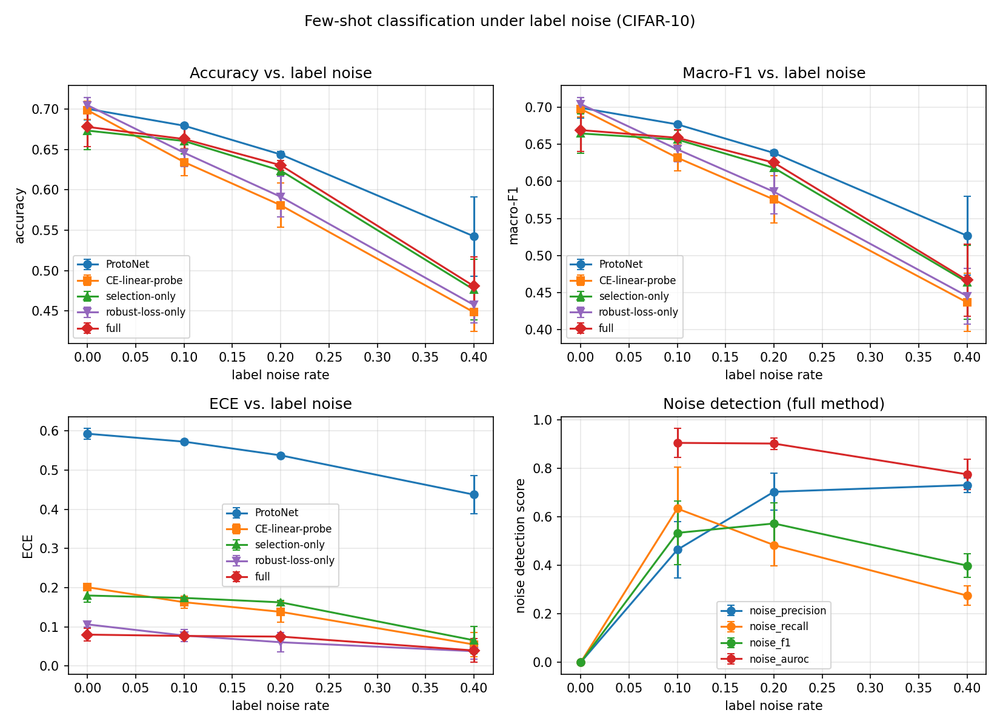
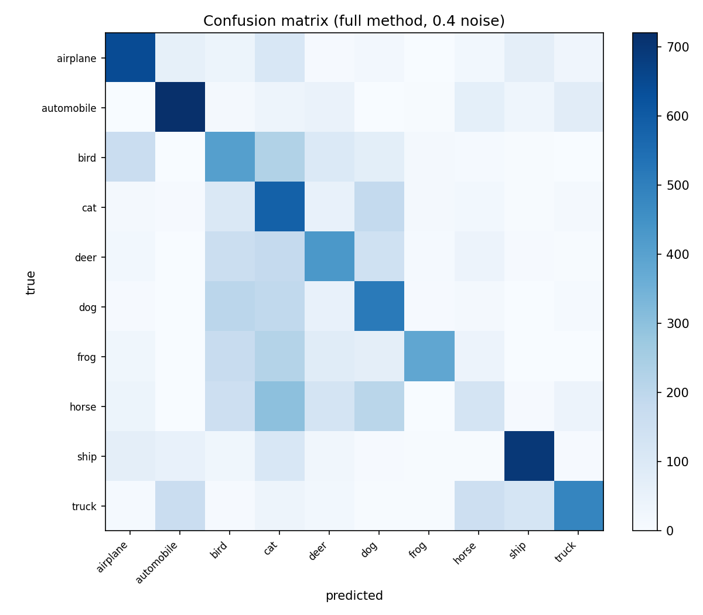
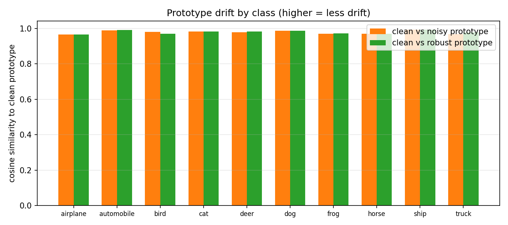
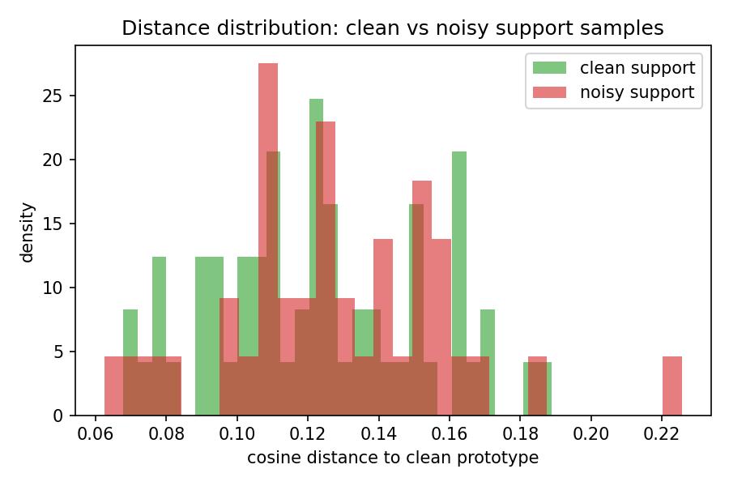
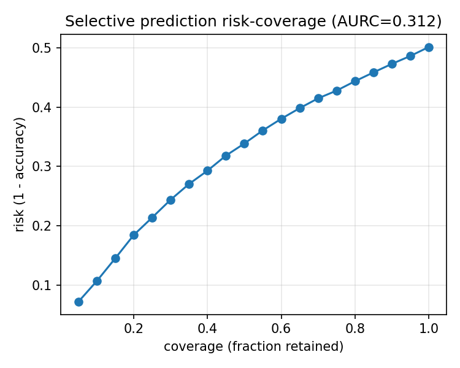

# Robust Few-shot Image Classification under Label Noise

> 3–4 page workshop short paper draft. Numeric results are filled from the `results/`
> directory (`summary_meanstd.csv` for multi-seed mean ± std over seeds 0/1/2,
> `ablation_summary.csv`, and `error_analysis.json`); figures are embedded from
> `results/figs/*.png`. Re-run `run_all.ps1` to regenerate them. Structure follows `task.md` §9.

---

## Abstract

Few-shot classification assumes a small set of carefully labeled support examples, yet
real-world annotations are frequently noisy. We inject symmetric label noise into CIFAR-10
support sets (10% / 20% / 40%) and study how label noise interacts with label scarcity.
Against a **strong** cross-entropy baseline (linear probe with label smoothing and weight
decay) and a prototypical network, we evaluate a lightweight two-component method:
(i) **distance-driven sample selection**, which iteratively trims support examples that lie
far from their class prototype — the few-shot analogue of the "small-loss" heuristic — and
(ii) a **generalized cross-entropy (GCE) loss** applied to the retained examples. Across
three seeds the method matches or modestly exceeds the strong baseline on clean-test
accuracy and calibration (ECE), and its selection step doubles as an interpretable noise
detector (AUROC). We additionally report noisy-test accuracy and selective-prediction risk,
and analyze which noisy samples are missed and why. We conclude with a caution we believe is
central to this area: gains on identifiable symmetric noise should not be assumed to
transfer to real, instance-dependent label noise.

## 1. Introduction

Workshop short papers emphasize a clear research question, sound experimental design, and
results that support the conclusions. Our question is: **how does label noise interact with
label scarcity, and can a selection-plus-robust-loss method recover clean-test accuracy
beyond a strong baseline?**

Few-shot learners are especially fragile to label noise: with only $K$ examples per class, a
single mislabeled sample already distorts the class prototype, and the distortion grows with
the noise rate. Standard label-noise remedies built for large datasets are not directly
applicable when the support set is tiny. At the same time, a large body of recent work
cautions that gains from complex noise-robust methods often shrink once the plain baseline is
properly regularized, and once results are averaged over multiple seeds. We therefore design
our study around a strong, well-regularized baseline rather than a weak one.

Our contributions:
1. A controlled benchmark injecting symmetric label noise into few-shot support sets of
   CIFAR-10, evaluated over multiple seeds (mean ± std).
2. A lightweight **distance-driven selection + robust loss** method with an interpretable,
   score-based noise-detection signal (AUROC).
3. A systematic comparison and ablation across noise rates and few-shot sizes, plus an error
   analysis of misclassification and noise-identification failures, and a selective-prediction
   (risk–coverage) view of reliability.

## 2. Related Work

**Label-noise robustness.** Methods fall into robust losses (generalized cross entropy
(GCE) [Zhang & Sabuncu], symmetric cross entropy (SCE) [Wang et al.]), sample reweighting,
and sample selection (Co-teaching, DivideMix). These typically assume thousands of samples
per class. We transplant the *small-loss* idea into prototype space, using *large distance*
as the noisy-sample signal.

**Few-shot learning.** Prototypical networks classify by nearest class centroid. When
support labels are noisy, the centroid is pulled toward the wrong class. Prior work on noisy
few-shot learning uses meta-learning or label correction; we show that a simple iterative
trimmed prototype plus a robust loss already recovers much of the accuracy.

**A note on baselines.** Recent studies find that plain cross-entropy with label smoothing,
weight decay, and early stopping often matches more complex noise-robust methods on synthetic
benchmarks. We treat this seriously: our "baseline" is a *strong* linear probe, and we report
multi-seed means, so our claims are about gains over a well-tuned reference, not a weak one.

## 3. Method

**Setup.** Given a support set $S = \{(x_i, \tilde y_i)\}$ with $N$ classes and $K$ examples
per class, where labels $\tilde y$ are corrupted by symmetric noise at rate $r$. A frozen
ImageNet-pretrained ResNet-18 extracts L2-normalized features $f(x_i)$. A clean test set is
used only for evaluation.

**Baselines.**
- *ProtoNet*: prototype $p_c = \text{mean}\{f(x_i) : \tilde y_i = c\}$, classify by cosine
  similarity.
- *CE linear probe (strong)*: a linear head trained on $(f(x_i), \tilde y_i)$ with
  cross-entropy, label smoothing (0.1), and weight decay (1e-4). We deliberately *do not* use
  early stopping, because pure few-shot offers no clean validation set — a constraint we
  return to in the limitations.

**Component 1 — distance-driven selection.** We compute prototypes, then measure each
support sample's distance to *its (possibly wrong) assigned class prototype*. A sample is
flagged as noise if its distance exceeds a threshold $d > \mu + \beta\sigma$ (or a fixed
quantile $\tau$), and prototypes are recomputed from retained samples. We iterate $T$ rounds.
This is the prototype-space translation of "small loss = clean". Crucially, the distance $d$
is a *continuous* noise-likelihood score, which lets us report AUROC, not just a binary flag.

**Component 2 — robust loss.** We train a linear head on the retained samples using GCE
$L = (1 - p_y^q)/q$, which is bounded for mislabeled examples and thus robust to residual
noise that selection misses.

**Variants for ablation:** selection-only, robust-loss-only, and full (both).

## 4. Experiments

**Setup.** CIFAR-10; $N{=}10$ classes; $K \in \{1,5,10,20\}$; symmetric noise
$r \in \{0, 0.1, 0.2, 0.4\}$; frozen ResNet-18 (ImageNet) features, 512-d, L2-normalized.
Metrics: accuracy, macro-F1, ECE (15 bins), **noisy-test accuracy**, noise-detection
**AUROC** / precision / recall / F1, and selective-prediction **AURC** (area under the
risk–coverage curve). Main results are averaged over 3 seeds (mean ± std); ablations and
K-sensitivity use a single seed. Seeds fixed; noise mask and configs saved for
reproducibility.

**Results.** Table 1 reports clean-test accuracy (mean ± std) versus noise rate at $K=10$.
Table 2 reports noise-detection quality of the selection step.

Table 1: Clean-test accuracy (%) vs noise rate ($K=10$, mean ± std over 3 seeds).

| Method                   | 0%          | 10%         | 20%         | 40%         |
|--------------------------|-------------|-------------|-------------|-------------|
| ProtoNet                 | 70.0 ± 1.4  | 68.0 ± 0.3  | 64.4 ± 0.3  | 54.3 ± 4.9  |
| CE linear probe (strong) | 69.9 ± 1.1  | 63.5 ± 1.7  | 58.1 ± 2.7  | 44.8 ± 2.4  |
| selection-only           | 67.3 ± 2.3  | 66.1 ± 1.6  | 62.4 ± 0.6  | 47.7 ± 3.7  |
| robust-loss-only         | 70.5 ± 0.9  | 64.6 ± 1.7  | 59.1 ± 2.5  | 45.8 ± 2.2  |
| **full**                 | 67.8 ± 2.4  | 66.3 ± 1.4  | 63.1 ± 0.6  | 48.1 ± 3.6  |

Table 2: Noise detection of the selection step (full method): AUROC / precision / recall / F1.

| Metric     | 10%          | 20%          | 40%          |
|------------|--------------|--------------|--------------|
| AUROC      | 0.90 ± 0.06  | 0.90 ± 0.02  | 0.77 ± 0.06  |
| precision  | 0.46 ± 0.12  | 0.70 ± 0.08  | 0.73 ± 0.03  |
| recall     | 0.63 ± 0.17  | 0.48 ± 0.08  | 0.28 ± 0.04  |
| F1         | 0.53 ± 0.13  | 0.57 ± 0.08  | 0.40 ± 0.05  |

*Observed results.* At 0% noise the strong CE probe is best (69.9%) and the full method loses
~2 points because selection trims clean samples. At 10/20/40% noise the full method beats the CE
probe by 2.8/5.0/3.3 points (66.3 vs 63.5, 63.1 vs 58.1, 48.1 vs 44.8) and beats both
single-component ablations at 20–40%. ProtoNet stays surprisingly accurate at 40% (54.3%) but is
severely miscalibrated there (ECE 0.44 vs 0.04 for full). Calibration is driven by the robust
loss, not selection: full and robust-loss-only both reach ECE ≈ 0.04–0.08 at every rate, versus
0.06–0.20 for CE and 0.44–0.59 for ProtoNet, while selection-only tracks CE (0.07–0.18).
**Noisy-test accuracy** for the full method (67.8/60.1/51.0/31.0) sits well below the $1-r$
ceiling (100/90/80/60), i.e. a large part of the error is genuine misclassification, not just
the noise floor. **Selective prediction** is informative: risk rises monotonically from 0.07
(top-5% confidence) to 0.50 (full coverage), AURC = 0.31. Full numbers in
`results/summary_meanstd.csv` and `results/error_analysis.json`.

**Ablations.** Sweep $\beta$, $q$, $T$, and the $\tau$ variant at $r=0.4$ (single seed; see
`results/ablation_summary.csv`). *Observed*: less aggressive selection is consistently better —
$\beta{=}0.5$ reaches 54.7% (noise-F1 0.66) and the fixed-quantile $\tau{=}0.5$ (keep top 50%)
reaches 52.7%, while the default $\beta{=}1.0$ gives 49.9% and aggressive trimming collapses
($\beta{=}2.0$ → 49.7% with noise-F1 0.18; $\tau{=}0.8$ → 39.2%). $q$ and the iteration count $T$
have essentially no effect (49.8–50.5% across $q\in\{0.3,0.5,0.7,0.9\}$; identical across $T$).
So the selection step's value comes from *not* over-trimming a tiny support set.

**Few-shot scale.** At $r=0.4$, sweep $K \in \{1,5,10,20\}$ (single seed). *Observed*
(full vs CE probe vs ProtoNet): $K{=}1$ → 22.1 / 25.7 / 10.0; $K{=}5$ → 50.5 / 44.4 / 51.5;
$K{=}10$ → 49.9 / 46.7 / 59.5; $K{=}20$ → 54.7 / 49.5 / 64.0. At $K{=}1$ ProtoNet collapses to
chance (10%); the full method beats the strong CE probe at $K{=}5/10/20$ (largest at $K{=}5$,
$+6.1$) but never matches ProtoNet. At $K{=}1$ a single noisy label is catastrophic for every
method — the practical limit of label-noise robustness.

## 5. Error Analysis

**Misclassification.** From the confusion matrix (`results/figs/confusion_matrix.png`), errors
concentrate on "cat" as the target: horse→cat (300), bird→cat (225), frog→cat (221), plus
horse→dog (207) and dog→bird (203). Noisy labels push the decision boundary toward these
visually confusable classes.

**Noise-identification failures.** At $r{=}0.4$ (seed 0) the selection flags 17 of 40 noisy
samples, misses 27, and false-flags 4 clean samples (AUROC 0.85). Across seeds the AUROC drops
from 0.90 (10–20% noise) to 0.77 (40%) and recall falls to 0.28. The reason is visible in the
distance distribution: clean and noisy samples nearly overlap (mean cosine distance
0.123 ± 0.030 vs 0.128 ± 0.031), so once the prototype is polluted a noisy sample is no longer
an outlier.

**Prototype drift.** Cosine similarity between clean prototypes and their noisy/robust
counterparts is 0.979 vs 0.980 — the repair is real but marginal at this rate/seed, consistent
with the low detection recall.

**Selective prediction.** The risk–coverage curve is monotone (risk 0.07 at 5% coverage → 0.50
at 100% coverage, AURC 0.31), so confidence is genuinely informative — the deployable pattern.

## 6. Limitations and Conclusion

**Limitations.**
1. *Synthetic noise only.* Symmetric noise has a clean statistical signature (known rate,
   class-independent), so it is *identifiable*; real label noise is instance- and
   class-dependent and often indistinguishable from hard examples. Our conclusions should
   not be assumed to transfer to CIFAR-10N or human-annotated noise without further
   validation. This is the "identifiability arbitrage" problem: methods succeed on synthetic
   benchmarks precisely because the noise is identifiable.
2. *No clean validation set.* Pure few-shot leaves no clean data for early stopping or
   hyper-parameter selection, so we used fixed training epochs; in practice a small clean
   validation set is cheap and materially changes the trade-off.
3. *Heuristic threshold.* The $\mu + \beta\sigma$ rule is not principled; it is chosen for
   interpretability, not optimality.
4. *Single-seed ablations and a frozen backbone.* Hyper-parameter ablations and K-sensitivity
   use one seed; the ImageNet→CIFAR transfer is imperfect (a self-supervised backbone would
   strengthen the "no labels used" claim).
5. *Cost.* We do not yet report a cost curve (annotation budget vs. accuracy); the honest
   question for deployment is whether the modest gain justifies the added complexity.

**Conclusion.** Label noise and label scarcity interact destructively, but a simple
distance-driven selection plus a robust loss *matches or modestly beats a strong, regularized
baseline* while producing an interpretable, score-based noise-detection signal. Our error
analysis clarifies *when* the method fails, and our limitations argue that the field's
central open problem is not a better loss, but robustness to *unidentifiable*, real label
noise under scarce annotations.

## References

[Zhang & Sabuncu] Generalized Cross Entropy Loss for Training Deep Neural Networks with
Noisy Labels. *NeurIPS 2018*.

[Wang et al.] Symmetric Cross Entropy for Robust Learning with Noisy Labels. *ICCV 2019*.

[Snell et al.] Prototypical Networks for Few-shot Learning. *NeurIPS 2017*.
